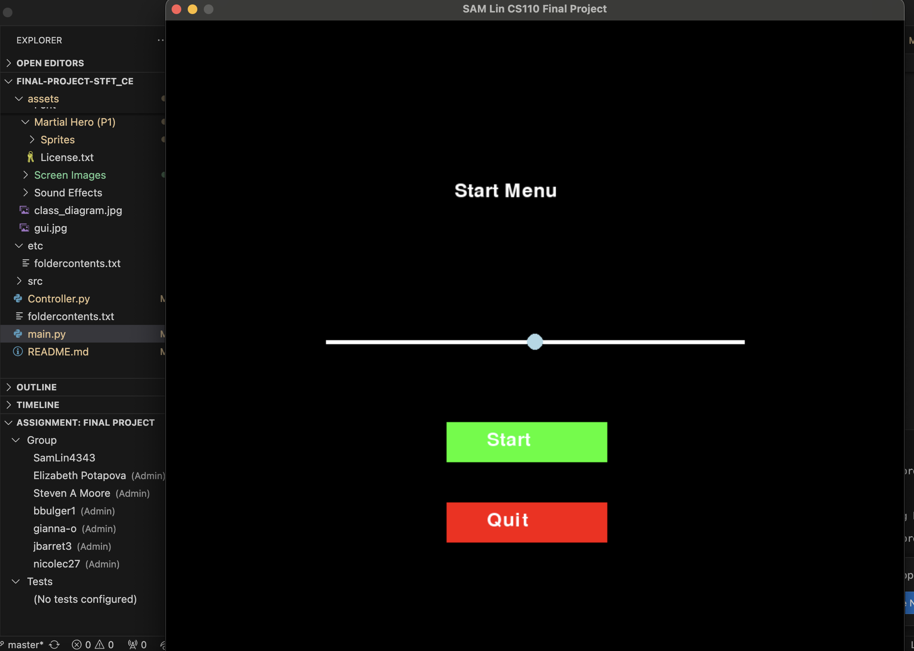

:warning: Everything between << >> needs to be replaced (remove << >> after replacing)

# << CS110 Project >>
## CS110 Final Project  << Spring, 2024 >>

## Team Members

*** Sam Lin

## Project Description

<< A one stage 2D pixel base street fighter game that you would see in a aracade back in the day. >>

## GUI Design

### Initial Design

### Final Design

## Program Design

### Features

1. Count Down Before Games Begans
2. Moveable character
3. Health Bar
4. Game-Over Screen
5. Ingame sound-track

### Classes

- << 
Magic: two basic attacks
Melee: physical type character with >>

## ATP

| Step                 |Procedure             |Expected Results                   |
|----------------------|:--------------------:|----------------------------------:|
|  1                   | Run Counter Program  |GUI window appears with count = 0  |
|  2                   | click count button   | display changes to count = 1      |
etc...
